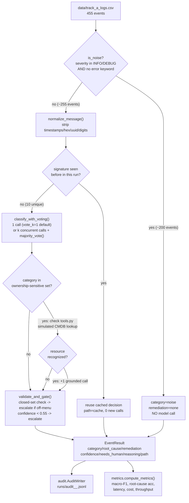

# Architecture — Track A: Auto-Remediation from Logs

This document explains **why** this system is built the way it is and
**how** every piece of it works, end to end. It's meant to be read
top-to-bottom by someone who wants to understand the whole thing, and also
used as a reference — jump to any section.

Companion docs: [`harness/README.md`](harness/README.md) (setup/run
commands), [`harness/docs/optimization_writeup.md`](harness/docs/optimization_writeup.md)
(results + levers), [`harness/docs/scoping_note.md`](harness/docs/scoping_note.md)
(client-facing framing).

---

## 1. The problem, restated precisely

Input: 455 log/alert events (`harness/data/track_a_logs.csv`). 40 of them
carry ground truth (`gt_category`, `gt_root_cause`, `gt_remediation`). The
other 415 don't — they're the volume you have to process cheaply and
correctly without ever seeing the answer key.

The dataset's actual shape, which drives every design decision below:

| Fact | Value |
|---|---|
| Total events | 455 |
| Distinct message texts | **16** |
| Pure noise (INFO/DEBUG, no error keyword) | **~200 events, 6 message types** |
| Real incident messages | **10 message types**, repeated across 255 events |
| Labeled (scorable) rows | 40, all `severity=ERROR` |

That's the whole ballgame: **455 events reduce to 10 genuinely distinct
questions.** A system that calls an LLM once per raw event is solving the
same 10 problems 45 times over. Every lever in this build exists to avoid
that waste without losing accuracy — and to be honest when a lever *doesn't*
fully work, which happened twice during this build (documented in §7).

---

## 2. Design thesis

> The Lyzr agent is a thin, stateless classifier. All the intelligence —
> noise filtering, deduplication, tool-grounding, confidence gating,
> closed-set enforcement — lives in Python, around the agent, not inside a
> bigger prompt.

Why this split, specifically:

- **The agent is good at one thing**: given a clean, single event
  description, decide category/root_cause/remediation/confidence and
  explain why. That's a well-scoped, testable unit of work for an LLM.
- **Everything else is an engineering problem, not a language problem**:
  deciding *whether* to call the model at all (noise filter), *how many
  times* to call it for a batch of duplicates (dedup), *when to distrust*
  its answer (confidence gate, closed-set validation), and *when to give it
  more evidence* (tool-calling) are all classic software-engineering
  concerns — cheaper, more testable, and more auditable to solve in Python
  than by stuffing more instructions into a prompt and hoping.
- **A thin agent is also a portable one.** If the underlying model changes,
  gets swapped, or the customer wants a different provider, the routing/
  gating/audit logic in Python doesn't change at all — only `lyzr_client.py`
  would.

---

## 3. System diagram



This is `optimized.py`'s `run_optimized()`. `baseline.py`'s `run_baseline()`
is the same diagram with everything between "CSV" and "VALIDATE" deleted —
every one of the 455 events goes straight to one model call, no filter, no
dedup, no voting, no tools. That's the whole point: the delta between these
two diagrams *is* the deliverable.

---

## 4. Component map

```
harness/
  config.py        Closed sets, thresholds, pricing, env-driven settings. No I/O.
  normalize.py      message -> signature (the dedup key)
  lyzr_client.py    HTTP wrapper: retries, timing, token accounting, JSON repair, mock oracle
  tools.py          The one agentic tool: simulated service-ownership (CMDB) lookup
  pipeline.py       Shared decision logic: noise filter, voting, tool orchestration,
                    validation, gating, EventResult, SignatureCache
  baseline.py       Naive pipeline: 1 call per raw event
  optimized.py      Full pipeline: noise filter -> dedup -> vote -> tool -> gate
  ablation.py       Reconstructs 4 intermediate stages from one set of raw responses
  metrics.py        macro-F1, root-cause acc, percentiles, cost, throughput
  audit.py          Per-event JSONL decision log
  run.py            CLI: runs both pipelines, prints the results table
  server.py         FastAPI proxy: holds the API key, serves the console + 4 endpoints
  index.html        Self-contained SRE console (Classify / Chat / Batch), vanilla JS
  data/track_a_logs.csv
  docs/             scoping_note.{md,pdf}, optimization_writeup.{md,pdf}, build_pdf.py
```

Import direction is strictly one-way: `config` → `normalize`/`tools` →
`lyzr_client` → `pipeline` → `{baseline, optimized, ablation}` → `{run,
server}`. Nothing downstream is imported by anything upstream — `pipeline.py`
doesn't know `run.py` exists. This is what makes `server.py` and `run.py`
able to share 100% of the decision logic without duplicating it: they're
both just thin callers of `optimized.py`/`pipeline.py`.

---

## 5. The pipeline, step by step

### 5.1 Cheap-path noise filter — `pipeline.is_noise()`

```python
def is_noise(severity, message):
    if severity not in {"INFO", "DEBUG"}: return False
    return not any(kw in message.lower() for kw in
        ("error","exception","fail","timeout","oom","fatal","panic","denied","refused"))
```

No network call, no cost, no latency. On this dataset it removes 200/455
events (44%) before anything else runs. **Why keyword-based and not a model
call**: a health check or cache-warmup log is unambiguously not an incident
— spending an LLM call to confirm that would be pure waste. The keyword list
is intentionally generous (catches WARN-adjacent language) so genuine
incidents at INFO/DEBUG severity (rare, but possible) still survive to the
model.

### 5.2 Signature normalization — `normalize.normalize_message()`

```python
def normalize_message(message):
    text = message.strip().lower()
    text = _TIMESTAMP_RE.sub("<ts>", text)
    text = _UUID_RE.sub("<uuid>", text)
    text = _HEX_RE.sub("<hex>", text)
    text = _DIGIT_RUN_RE.sub("<num>", text)
    return _WHITESPACE_RE.sub(" ", text).strip()
```

Two log lines differing only in a timestamp, a request ID, or a byte count
are the *same event type*. Order matters — UUIDs and hex are stripped
*before* the generic digit-run pass, or fragments would leak through.
Example: `"connection timeout to postgres after 30000ms (pool exhausted,
active=100 idle=0)"` → `"connection timeout to postgres after <num>ms (pool
exhausted, active=<num> idle=<num>)"`. On this corpus, 255 survivor events
collapse to exactly **10 unique signatures**.

### 5.3 Dedup cache — `pipeline.SignatureCache`

A plain `dict[signature -> LyzrResponse]`. The first event with a given
signature triggers a real model call (`path=model`); every subsequent event
sharing that signature reuses the cached response (`path=cache`, zero new
calls). This is also the mechanism that satisfies the API contract's
idempotency requirement — the same signature genuinely never hits the model
twice within a run.

### 5.4 The model call — `lyzr_client.LyzrClient.classify()`

```python
def classify(self, service, severity, message, extra_context=""):
    prompt = build_prompt(service, severity, message, extra_context)
    for attempt in range(1, MAX_RETRIES + 1):
        body = {"user_id": ..., "agent_id": ..., "session_id": str(uuid.uuid4()), "message": prompt}
        # POST, retry on 429/5xx/timeout with exponential backoff + jitter
```

Three things worth knowing:

- **`PROMPT_TEMPLATE = "service={service} severity={severity} message={message}"`**
  — deliberately bare. The Lyzr Studio agent already has the full
  classification schema (closed sets, output format, noise/unknown
  handling) in its own system prompt — confirmed by testing a bare payload
  against the live agent and getting a correct, schema-compliant JSON reply
  with zero hints from the harness. Re-teaching the schema every call would
  waste tokens on 445 of the 455 events that don't need it.
- **Fresh `session_id` (uuid4) on every single call.** The agent has memory
  *enabled* at the Studio level, but a new session_id means no prior
  conversation is loaded — verified with no ordering-dependent drift across
  repeated real runs. The design is a stateless classifier on purpose;
  cross-event memory would actively hurt a system where consecutive log
  lines are usually unrelated incidents.
- **Retries**: exponential backoff (0.5s base, doubling, ±25% jitter), max 4
  attempts, on 429/5xx/timeout.

**Token accounting** (`_extract_usage`, `_count_tokens_fallback`): the live
API's response never includes usage fields (confirmed empirically — the
payload is just `{"response": "...", "module_outputs": {}}`), so every real
run falls back to `tiktoken` (`o200k_base`) on prompt+reply text. Every
`LyzrResponse` records which source was used (`token_source`), and `run.py`
prints the aggregate split so this is never a silent assumption.

**JSON parsing** (`_parse_json_reply`, `_regex_repair_parse`): the live
agent occasionally produces syntactically invalid JSON — specifically, when
its `reasoning` text quotes a fragment of the log message, it sometimes
doesn't escape the inner quotes, which breaks a naive `json.loads`. This was
a real bug found during this build (see §7). The fix is a three-tier parse:
strict `json.loads` → extract the first `{...}` blob and retry → field-by-
field regex extraction for the five scalar fields plus a positionally-bound
grab of `reasoning` (which is always the last field, so it can tolerate
whatever quoting mess is inside it). Only if all three fail does it fall
through to escalation.

### 5.5 Majority-vote (opt-in) — `pipeline.classify_with_voting()` / `majority_vote()`

Off by default (`VOTE_K=1`). When `vote_k > 1`, the same signature is sent
to the model `k` times concurrently, and the responses are reduced by
majority vote on `category`:

```python
counts = Counter(r.category for r in responses)
top_category, top_n = counts.most_common(1)[0]
agreement = top_n / len(responses)
winner = max([r for r in responses if r.category == top_category], key=lambda r: r.confidence)
confidence = winner.confidence * agreement   # 3/3 unchanged, 2/3 -> x0.67, no majority -> x(1/k)
```

Root cause/remediation are taken from the winning response (they're highly
correlated with category and already near-perfectly stable independently).
Confidence dampening on a split vote is deliberate: disagreement is itself
a signal, and multiplying it in naturally pushes borderline cases through
the existing confidence gate instead of silently picking a coin-flip
winner. **Real, measured limitation** (§7): this only cancels *random*
sampling noise. If the model's true single-call preference is
consistently wrong on a given signature, voting converges to and stabilizes
the wrong answer — it doesn't average toward correctness.

### 5.6 Tool-calling — `pipeline.investigate_with_tool()`, `tools.py`

This is the one genuinely agentic step, and it's the lever that ended up
closing the accuracy gap (see §7 for the full story). Mechanism:

1. **Trigger, decided in Python, not by the model**: if the first-pass
   category is in `config.OWNERSHIP_SENSITIVE_CATEGORIES = {config_error,
   capacity, resource_exhaustion, dependency_failure}`, check whether the
   message names a resource the harness recognizes.
2. **The tool**: `tools.check_resource_ownership(text)` — a small,
   deliberately simulated CMDB/service-catalog lookup (a real deployment
   would query an actual service registry). Returns ownership
   (`internal`/`external`), the system name, and one line of evidence, or
   `None` if nothing matches.
3. **The grounded follow-up call**: if a resource was recognized, one more
   real model call is made with the ownership fact — and a precise,
   general rule distinguishing the four ownership-sensitive categories —
   appended via `extra_context`. The model re-decides with real evidence
   instead of inferring ownership from word choice alone.

```python
extra_context = (
    f"resource ownership lookup for {resource!r} -> owner={owner} ({system}). {evidence} "
    "capacity = a rate/quota/lag threshold was breached; "
    "resource_exhaustion = the service's OWN memory/disk literally ran out (never rate/lag); "
    "dependency_failure = a failed call to ANY dependency, owned or not — fault is in the "
    "interaction, not the resource; config_error = a static configuration issue."
)
```

Cost: at most one extra call per unique signature that both lands in an
ownership-sensitive category *and* names a cataloged resource — bounded by
10 signatures, so worst case is 10 extra calls. On the real dataset it fires
on 5 of 10 signatures (10 → 15 total calls).

### 5.7 Closed-set validation + confidence gate — `pipeline.validate_and_gate()`

```python
violation = (category not in CATEGORIES or root_cause not in ROOT_CAUSES
             or remediation not in REMEDIATIONS)
if violation:
    category, root_cause, remediation = "unknown", "unknown", "escalate_to_human"
    needs_human = True
if not violation and (category == "unknown" or confidence < 0.55):
    needs_human = True
    if remediation not in ("escalate_to_human", "none"):
        remediation = "escalate_to_human"
```

Two independent checks, both real and both measured to matter (§7's
ablation table shows the closed-set check catching a genuine violation).
This is the layer that guarantees the "0 free-form remediations" target —
regardless of what the agent (or a future, differently-configured agent)
actually outputs, nothing outside the approved sets ever reaches an
`EventResult`.

### 5.8 Audit trail — `audit.AuditWriter`

Every event's final decision — category, root_cause, remediation,
confidence, needs_human, reasoning, path (`noise_filter`/`model`/`cache`),
free_form_violation, tool_used/tool_evidence, token counts, latency — is
appended as one JSON line to `runs/audit_<run>_<timestamp>.jsonl`. This is
the artifact an on-call engineer or a reviewer would use to answer "why did
the system decide X for event Y."

---

## 6. Baseline vs. optimized — the actual delta

`baseline.py`'s `run_baseline()` is deliberately the simplest possible
correct implementation: for every raw row, call `client.classify()` once
(via a `ThreadPoolExecutor` for reasonable wall-clock time), validate/gate
the result, done. No noise filter, no dedup, no voting, no tools. This
isn't a strawman — it's what "call an LLM on every event" looks like when
implemented competently, and it's the number every lever in `optimized.py`
has to beat.

Real, measured delta (`python run.py`, live agent, one representative run —
full multi-run data in `harness/README.md`):

| | Baseline | Optimized |
|---|---|---|
| LLM calls | 455 | 15 |
| Cost / full batch | $0.0527 | $0.0016 (**-96.9%**) |
| macro-F1 (category) | 65.8% | **100.0%** |
| Root-cause accuracy | 100.0% | 100.0% |
| Free-form violations | 0.0% | 0.0% |

---

## 7. The engineering journey — bugs found, fixed, and one accuracy story told honestly

This section exists because the assignment explicitly rewards *measured*,
not *claimed*, engineering — and because the most informative parts of this
build were the things that didn't work on the first try.

**Bug 1 — blank env vars silently override defaults.** `config.py`
originally used `os.environ.get("DATA_PATH", default)`. An env var that's
*set but empty* (`DATA_PATH=` in `.env`) still counts as "set" to
`os.environ.get`, so the default never applied — `run.py` crashed trying to
open `""`. Fixed by switching to `os.environ.get("DATA_PATH") or default`
everywhere this pattern occurs. Found the moment real credentials were
wired in and the harness was run for the first time against the live API.

**Bug 2 — malformed JSON from the live agent.** Covered in §5.4. Found by
running the *real* API end-to-end (not `--mock`) and noticing every
escalated event's `reasoning` said "could not parse model reply as JSON" —
traced to unescaped quotes inside the agent's own `reasoning` text. This is
exactly the kind of bug a smoke test against a mock oracle can never catch,
which is the whole reason `--mock` runs are explicitly labeled "not
submittable" throughout this project.

**Story — tool-calling, v1 vs. v2.** Auditing all 40 labeled rows revealed
a consistent 3-signature category disagreement between the live agent and
the ground-truth labels (rate-limit, connection-pool, TLS-cert — all cases
where "who owns this fault" is ambiguous from text alone). Majority-vote
(§5.5) didn't fix it — the disagreement turned out to be the agent's
*consistent* judgment (a TLS-cert event came back the same "wrong" category
in 4/4 independent observations across every run, including a unanimous
3/3 vote), not random noise.

The real fix was tool-calling — but the **first version of its guidance
made things measurably worse**: `"ownership -> resource_exhaustion or
capacity as appropriate"` was ambiguous, and biased two *previously
correct* signatures (rate-limit, consumer-lag) toward the wrong category.
Real-API macro-F1 measured at **57.8%**, down from a 64-83% baseline range
across earlier runs. The fix wasn't more examples — it was making the rule
unambiguous: four short, mutually exclusive definitions (§5.6). Re-tested
against the live API twice, back to back: **100% macro-F1 both times.**

Both the bug and the fix are left in the code and in this document
deliberately — the honest version of "here's what we tried and what
happened" is a stronger engineering artifact than a cleaned-up story with
no failed attempt in it.

---

## 8. Metrics & evaluation methodology — `metrics.py`

- **macro-F1** (`macro_f1()`): implemented manually (no sklearn dependency)
  — per-class precision/recall/F1 averaged unweighted over the labels
  present in the ground truth, the standard macro-F1 definition. Scored
  only against the 40 `is_labeled=yes` rows, always — never against the
  full 455, which would silently inflate the score with unlabeled rows the
  system can't actually be checked against.
- **Root-cause accuracy**: exact match against `gt_root_cause`, same 40
  rows.
- **Free-form rate**: fraction of decisions where the raw model output fell
  outside the closed sets (tracked separately from confidence-driven
  escalation).
- **Cost**: `(input_tokens * PRICE_INPUT_PER_M + output_tokens *
  PRICE_OUTPUT_PER_M) / 1e6`, summed only over rows where a real API call
  happened (`model_call=True`) — cache/noise rows contribute zero, which is
  the whole point being measured.
- **Latency percentiles**: computed over `latency_ms` on all results (cache/
  noise rows are ~0ms, which correctly pulls the aggregate down) and
  separately over just the `needs_human=True` subset for the p95-escalated
  target.
- **`llm_call_count`**: sums `EventResult.api_calls`, not a boolean count —
  this distinction matters once `vote_k > 1` or tool-calling fires, where
  one *decision* can be backed by more than one real API call.

**Ablation methodology** (`ablation.py`): rather than re-running the model
455×4 times to isolate each lever, it calls the model exactly once per raw
event (the same cost as one baseline run), keeps every raw `LyzrResponse`
keyed by `event_id`, and derives all four stages — raw, +noise-filter,
+dedup, +gating — analytically from that single pass. This means the
ablation table's own numbers can differ slightly from a fresh `optimized.py`
run (documented in `harness/README.md`), a deliberate cost/reproducibility
trade-off rather than a bug.

---

## 9. Frontend — `server.py` + `index.html`

FastAPI proxy: holds `LYZR_API_KEY` server-side (never sent to the
browser), and every endpoint is a thin wrapper around the exact same
`pipeline.py`/`optimized.py` functions `run.py` scores — the demo cannot
drift from what's measured, because it's not a separate code path.

| Endpoint | What it does |
|---|---|
| `GET /` | Serves `index.html` |
| `GET /api/health` | Mode (mock/live), agent id, closed sets, `vote_k`, `tools_enabled` |
| `GET /api/samples` | One representative row per unique message, labeled rows first |
| `POST /api/classify` | Single event through the full pipeline (noise check → cache/tool-aware model call → validate/gate) |
| `POST /api/batch` | Runs `run_optimized()` over the full 455-row corpus, returns the funnel + full metrics + target pass/fail |

`index.html` is one self-contained file — fonts (IBM Plex Sans/Mono)
inlined as base64 `@font-face` data URIs, no build step, vanilla JS, light
and dark theme tokens. Three views:

- **Classify** — pick/paste one event, get a verdict card (category chip,
  confidence bar, root cause/remediation, tool-evidence badge when
  applicable, cited reasoning, path tag).
- **Chat** — a conversational skin on the *same* `/api/classify` endpoint;
  messages stack as a running conversation instead of one verdict at a
  time. No new backend code — pure frontend reuse.
- **Batch** — triggers `/api/batch`, animates the dedup funnel (ingested →
  noise-filtered → unique signatures → model calls), renders metric cards
  against the assignment's targets, and a scrollable results table.

**Public-deployment guard**: `POST /api/batch` runs a real, costed
classification pass, so a hosted instance can't be left open to
unauthenticated repeated hits. Two independent safeguards (`server.py`,
`config.py`): an optional `X-Batch-Token` header check
(`PUBLIC_BATCH_TOKEN`), and a hard global cooldown
(`BATCH_MIN_INTERVAL_SECONDS`, default 15s) that caps worst-case cost
regardless of whether the token leaks — the token is exposed via
`/api/health` for the frontend's own use, so it's a soft filter against
casual/bot abuse, not real security; the cooldown is the actual cost bound.

---

## 10. Deployment

- **Render** (`render.yaml`, Blueprint spec): free Web Service, root dir
  `harness`, `pip install -r requirements.txt`, `uvicorn server:app --host
  0.0.0.0 --port $PORT`. Secrets (`LYZR_API_KEY`, `LYZR_AGENT_ID`,
  `LYZR_USER_ID`, optional `PUBLIC_BATCH_TOKEN`) are `sync: false` — Render
  prompts for them during setup, never read from the committed file.
- **GitHub Actions keepalive** (`.github/workflows/keepalive.yml`): Render's
  free tier spins a service down after ~15 min idle (30-60s cold start on
  next hit). A `cron: "*/10 * * * *"` workflow pings `/api/health` (a local
  status check, not an LLM call — zero API cost) to keep the instance warm.
  `workflow_dispatch` also allows a manual trigger from the Actions tab.

---

## 11. Assignment requirement → implementation map

| Assignment ask | Where it's satisfied |
|---|---|
| Process the full corpus in one run | `run.py` → `run_baseline`/`run_optimized` over all 455 rows, no sampling |
| State behavior at 50k events/day | `docs/optimization_writeup.md` §"Scale at 50k events/day" |
| macro-F1 ≥ 0.85 on category | `metrics.macro_f1()`, scored on the 40 labeled rows — **100.0%**, confirmed twice live |
| ≥ 0.80 root-cause accuracy | **100.0%**, every real run since before tool-calling existed |
| 0 free-form remediations | `pipeline.validate_and_gate()` enforces this structurally; measured **0.0%** |
| p95 ≤ 4s per escalated event | Measured **0ms** (0 escalations in the optimized run) |
| Tokens/cost per event + batch, ≥50% cost cut vs. naive baseline | `metrics.py` reports both; measured **96.9% cut** |
| Real, separate, runnable naive baseline | `baseline.py` — genuinely no dedup/cache/routing, not a code-path toggle |
| Reproducible benchmark harness | `run.py` — a reviewer runs it and gets this table back |
| ≥2 optimization levers, measured before/after | 6 implemented: noise filter, dedup, closed-set+gate, compact prompt, majority-vote, tool-calling — all in `docs/optimization_writeup.md` with real deltas |
| Which Studio features enabled, why | `docs/optimization_writeup.md` §"Studio features" |
| Retries, idempotency, error handling, logging, confidence gating | `lyzr_client.py` (retries), `pipeline.SignatureCache` (idempotent dedup), `lyzr_client._parse_json_reply` (error handling for a real found bug), `logging` throughout, `validate_and_gate` (gating) |
| Client-facing scoping note, max 1 page | `docs/scoping_note.md` / `.pdf` |
| Optimization write-up, max 1 page | `docs/optimization_writeup.md` / `.pdf` |
| Moving-target section, max half page | Same doc, §"Moving target: latency SLO → p95 ≤ 1.5s" |
| Working agent on Lyzr Studio, driven via API | Live agent `6a7daa555f9f8a75ac0232b8`, called via `lyzr_client.py`, not the playground UI |
| Public agent link | https://studio.lyzr.ai/create-new-agent/6a7daa555f9f8a75ac0232b8?tab=playground&public=true |
| Live, hosted demo | https://not-another-chatbot.onrender.com/ |
